# MyDesk architecture

How MyDesk is put together, where each part runs, and what happens step by step for the main flows. Every diagram is [Mermaid](https://mermaid.js.org/), so GitHub draws it right on this page.

**Contents**

1. [System context](#1-system-context)
2. [Components](#2-components)
3. [Deployment](#3-deployment)
4. [Folders and data](#4-folders-and-data)
5. [State diagrams](#5-state-diagrams): app lifecycle · lobby panels · tool jobs · events · stay-awake · dialogs
6. [Sequence diagrams](#6-sequence-diagrams): start-up · run a tool · Clip Maker · MyCheats dialog · USB plug-in · phone via Claude · WhatsApp · heartbeat · upgrade · release build
7. [Security model](#7-security-model)
8. [Design decisions](#8-design-decisions)

---

## 1. System context

MyDesk is one program on the user's own computer. Everything else is optional and is reached by MyDesk calling *out*; nothing calls *in* to the PC.

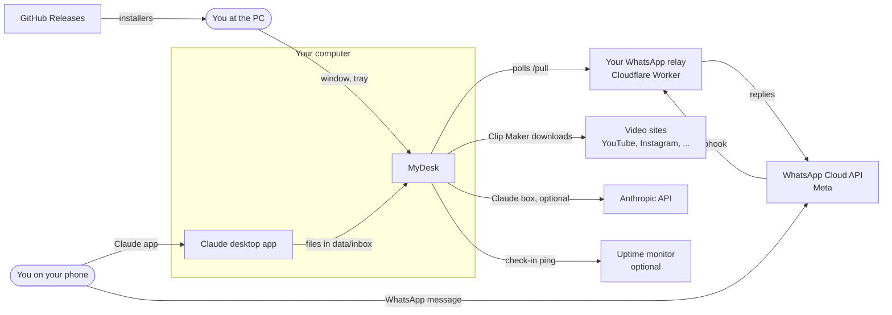
```mermaid
flowchart LR
    user(["You at the PC"])
    phone(["You on your phone"])

    subgraph PC["Your computer"]
        mydesk["MyDesk"]
        claudeapp["Claude desktop app"]
    end

    sites["Video sites<br/>YouTube, Instagram, ..."]
    anthropic["Anthropic API"]
    relay["Your WhatsApp relay<br/>Cloudflare Worker"]
    meta["WhatsApp Cloud API<br/>Meta"]
    hb["Uptime monitor<br/>optional"]
    gh["GitHub Releases"]

    user -- "window, tray" --> mydesk
    phone -- "Claude app" --> claudeapp
    claudeapp -- "files in data/inbox" --> mydesk
    phone -- "WhatsApp message" --> meta
    meta -- "webhook" --> relay
    mydesk -- "polls /pull" --> relay
    relay -- "replies" --> meta
    mydesk -- "Clip Maker downloads" --> sites
    mydesk -- "Claude box, optional" --> anthropic
    mydesk -- "check-in ping" --> hb
    gh -- "installers" --> user
```

| Outside system | Needed? | Direction | Used for |
| --- | --- | --- | --- |
| Video sites | Only for Clip Maker | Out | Download a clip with yt-dlp |
| Anthropic API | Optional (`ANTHROPIC_API_KEY`) | Out | Answers in the Claude box |
| Claude desktop app | Optional | Shared folder | Use MyDesk from your phone through Claude |
| WhatsApp relay + Meta | Optional | Out (polling) | Commands from WhatsApp |
| Uptime monitor | Optional (`heartbeat_url`) | Out | Phone alert when the PC goes off |
| GitHub Releases | For installing | Download | Installers, wheel, checksums |

---

## 2. Components

One Python process holds everything; each tool runs as its own short-lived child process.

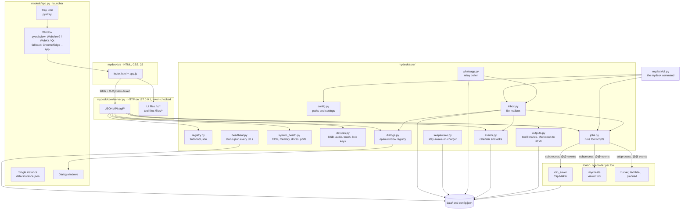
```mermaid
flowchart TB
    subgraph Launcher["mydesk/app.py · launcher"]
        single["Single instance<br/>data/.instance.json"]
        win["Window<br/>pywebview: WebView2 / WebKit / Qt<br/>fallback: Chrome/Edge --app"]
        tray["Tray icon<br/>pystray"]
        wdlg["Dialog windows"]
    end

    cli["mydesk/cli.py<br/>the mydesk command"]

    subgraph Server["mydesk/core/server.py · HTTP on 127.0.0.1, token-checked"]
        api["JSON API /api/*"]
        static["UI files /ui/*<br/>tool files /files/*"]
    end

    subgraph Core["mydesk/core/"]
        config["config.py<br/>paths and settings"]
        registry["registry.py<br/>finds tool.json"]
        jobs["jobs.py<br/>runs tool scripts"]
        health["system_health.py<br/>CPU, memory, drives, ports"]
        devices["devices.py<br/>USB, audio, touch, lock keys"]
        dialogs["dialogs.py<br/>open-window registry"]
        events["events.py<br/>calendar and acks"]
        heartbeat["heartbeat.py<br/>status.json every 30 s"]
        inbox["inbox.py<br/>file mailbox"]
        awake["keepawake.py<br/>stay awake on charger"]
        wa["whatsapp.py<br/>relay poller"]
        outputs["outputs.py<br/>tool libraries, Markdown to HTML"]
    end

    subgraph UI["mydesk/ui/ · HTML, CSS, JS"]
        page["index.html + app.js"]
    end

    subgraph Tools["tools/ · one folder per tool"]
        clip["clip_saver<br/>Clip Maker"]
        cheats["mycheats<br/>viewer tool"]
        future["zucker, techbite, ...<br/>planned"]
    end

    data[("data/ and config.json")]

    win --> page
    page -- "fetch + X-MyDesk-Token" --> api
    page --> static
    api --> registry & jobs & health & devices & dialogs & events & outputs
    dialogs --> wdlg
    jobs -- "subprocess, @@ events" --> clip & cheats & future
    tray --> win
    cli --> config & jobs & inbox
    heartbeat & inbox & awake & wa & events & outputs --> data
    inbox --> jobs & events & dialogs
    wa --> inbox
    Tools --> data
```

| Module | Job | Notes |
| --- | --- | --- |
| `app.py` | Start-up, single instance, window, tray, dialog windows, `--run-script` for frozen builds | Close button hides or minimizes; only Task Manager (or tray Quit if enabled) ends it |
| `cli.py` | `mydesk open / tools / run / cheats / status / ask / awake / autostart / backup / paths / version` | Same code as the app; works with or without the window running |
| `core/config.py` | Finds `APP_HOME`, `DATA_DIR`, `TOOLS_DIR`, `USER_TOOLS_DIR`; loads `config.json` | Source checkout → repo folder; installed → per-user folder; `MYDESK_HOME` overrides |
| `core/server.py` | `ThreadingHTTPServer` on 127.0.0.1, random port, per-launch token | Range requests for video seeking |
| `core/registry.py` | Reads every `tool.json` in built-in and user tool folders | Folders starting with `_` are skipped; user tools win on duplicate id |
| `core/jobs.py` | Builds the command line from the form, runs the script, parses `@@{json}` lines | Frozen builds run scripts through `MyDesk-tool --run-script` |
| `core/system_health.py` | CPU, memory, every drive, reboot/sign-in time, OS details, ports in use | psutil |
| `core/devices.py` | USB devices, audio output, touchscreen, Caps/Num/Scroll lock | ctypes + PowerShell CIM on Windows; best effort elsewhere |
| `core/dialogs.py` | Registry of open dialogs, counted in the title bar | Native windows under pywebview, in-page panels otherwise |
| `core/events.py` | Birthdays, anniversaries, seminars, bills; yearly repeats; per-occurrence acks | `data/events/events.json` |
| `core/heartbeat.py` | Writes `data/status/status.json` every 30 s; optional outgoing check-in | Read by `mydesk status` / `pc_status.py` |
| `core/inbox.py` | Reads `data/inbox/*.json`, runs allow-listed actions, writes `data/outbox/` | Never runs shell commands |
| `core/keepawake.py` | Holds the PC awake while Claude runs, only on AC power | `decide()` is a pure function, unit-tested |
| `core/whatsapp.py` | Polls your relay, turns messages into mailbox actions, sends replies | Only numbers in `ALLOWED_NUMBERS` |
| `core/outputs.py` | Lists a tool's saved files; renders Markdown notes to HTML | Front-matter drives cards |

---

## 3. Deployment

### 3.1 On one PC

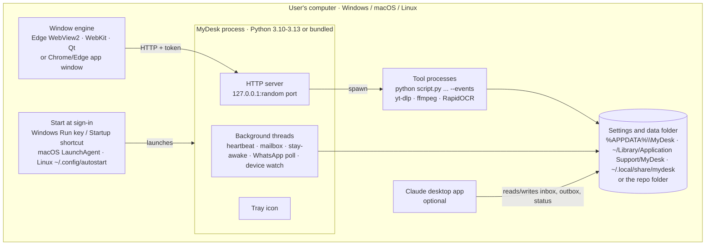
```mermaid
flowchart TB
    subgraph PC["User's computer · Windows / macOS / Linux"]
        subgraph Proc["MyDesk process · Python 3.10-3.13 or bundled"]
            srv["HTTP server<br/>127.0.0.1:random port"]
            bg["Background threads<br/>heartbeat · mailbox · stay-awake · WhatsApp poll · device watch"]
            trayp["Tray icon"]
        end
        wv["Window engine<br/>Edge WebView2 · WebKit · Qt<br/>or Chrome/Edge app window"]
        toolp["Tool processes<br/>python script.py ... --events<br/>yt-dlp · ffmpeg · RapidOCR"]
        fs[("Settings and data folder<br/>%APPDATA%\\MyDesk · ~/Library/Application Support/MyDesk · ~/.local/share/mydesk<br/>or the repo folder")]
        auto["Start at sign-in<br/>Windows Run key / Startup shortcut<br/>macOS LaunchAgent · Linux ~/.config/autostart"]
        cd["Claude desktop app<br/>optional"]
    end

    auto -- "launches" --> Proc
    wv -- "HTTP + token" --> srv
    srv -- "spawn" --> toolp
    toolp --> fs
    bg --> fs
    cd -- "reads/writes inbox, outbox, status" --> fs
```

### 3.2 With the optional cloud pieces

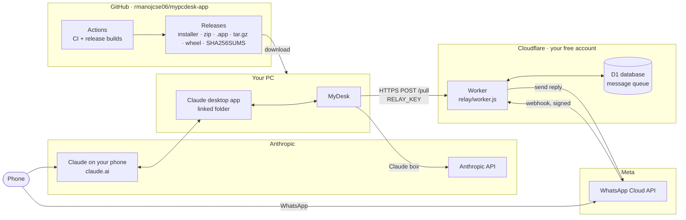
```mermaid
flowchart LR
    subgraph Home["Your PC"]
        md["MyDesk"]
        cda["Claude desktop app<br/>linked folder"]
    end

    subgraph Anthropic["Anthropic"]
        claudeai["Claude on your phone<br/>claude.ai"]
        api["Anthropic API"]
    end

    subgraph CF["Cloudflare · your free account"]
        worker["Worker<br/>relay/worker.js"]
        d1[("D1 database<br/>message queue")]
    end

    subgraph Meta["Meta"]
        wapi["WhatsApp Cloud API"]
    end

    subgraph GH["GitHub · rmanojcse06/mypcdesk-app"]
        actions["Actions<br/>CI + release builds"]
        rel["Releases<br/>installer · zip · .app · tar.gz · wheel · SHA256SUMS"]
    end

    phone(["Phone"])

    phone --> claudeai
    claudeai <--> cda
    cda <--> md
    phone -- "WhatsApp" --> wapi
    wapi -- "webhook, signed" --> worker
    worker <--> d1
    md -- "HTTPS POST /pull<br/>RELAY_KEY" --> worker
    worker -- "send reply" --> wapi
    md -- "Claude box" --> api
    actions --> rel
    rel -- "download" --> Home
```

### 3.3 What ships

| Package | Built by | Contents | Python needed |
| --- | --- | --- | --- |
| `MyDesk-Setup-<v>.exe` | PyInstaller + Inno Setup on `windows-latest` | `MyDesk.exe`, `MyDesk-tool.exe`, bundled Python and packages, uninstaller | No |
| `MyDesk-<v>-windows.zip` | PyInstaller | Same folder, portable | No |
| `MyDesk-<v>-macos.zip` | PyInstaller BUNDLE on `macos-latest` | `MyDesk.app` | No |
| `MyDesk-<v>-linux.tar.gz` | PyInstaller on `ubuntu-latest` | `MyDesk/` folder + `install.sh` | No |
| `mydesk-<v>-py3-none-any.whl` / sdist | `python -m build` | `mydesk` package; extras `clip`, `qt`, `all` | Yes, 3.10-3.13 |
| Source | git | Everything; `install.bat` / `install.sh` | Yes |

---

## 4. Folders and data

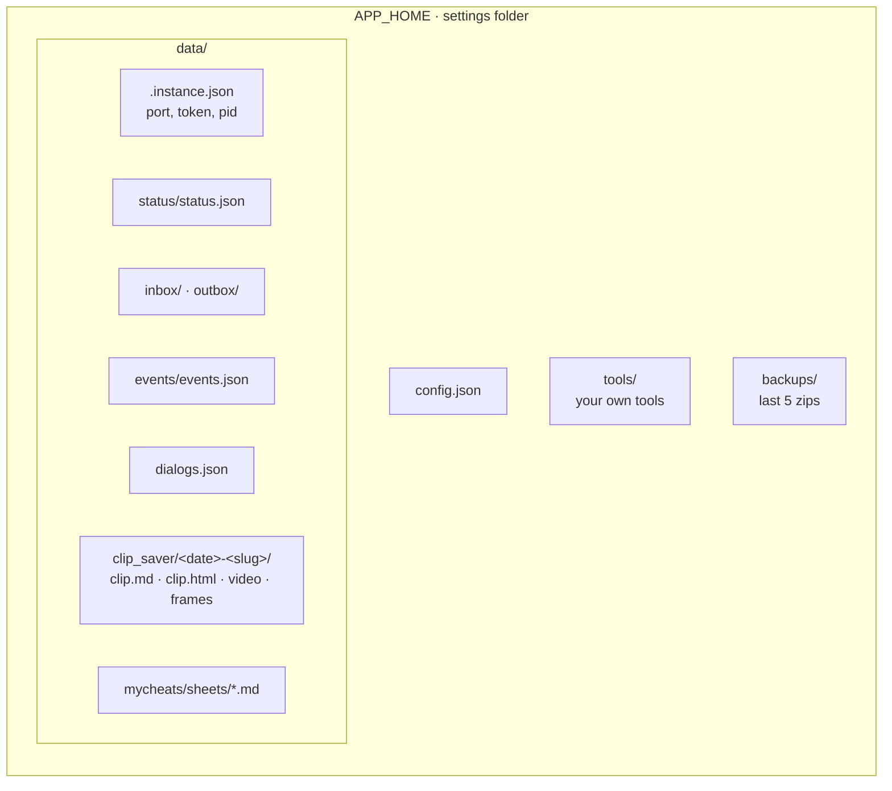
```mermaid
flowchart LR
    subgraph Home["APP_HOME · settings folder"]
        cfg["config.json"]
        ut["tools/<br/>your own tools"]
        bk["backups/<br/>last 5 zips"]
        subgraph Data["data/"]
            inst[".instance.json<br/>port, token, pid"]
            st["status/status.json"]
            ib["inbox/ · outbox/"]
            ev["events/events.json"]
            dl["dialogs.json"]
            clipd["clip_saver/&lt;date&gt;-&lt;slug&gt;/<br/>clip.md · clip.html · video · frames"]
            cheatd["mycheats/sheets/*.md"]
        end
    end
```

There is no database server. JSON and Markdown files are enough today; SQLite (built into Python) is planned when token history and full-text search over clips arrive. `config.json`, `data/` and `backups/` are git-ignored and are never touched by an update or uninstall.

---

## 5. State diagrams

### 5.1 App lifecycle

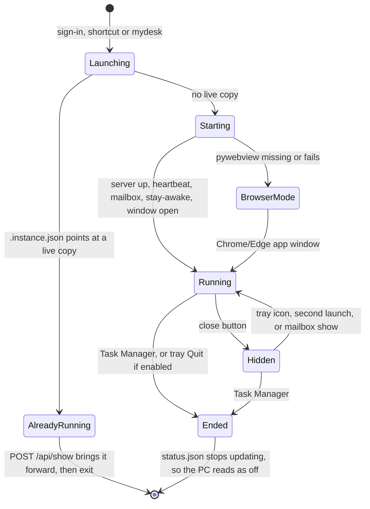
```mermaid
stateDiagram-v2
    [*] --> Launching: sign-in, shortcut or mydesk
    Launching --> AlreadyRunning: .instance.json points at a live copy
    AlreadyRunning --> [*]: POST /api/show brings it forward, then exit
    Launching --> Starting: no live copy
    Starting --> Running: server up, heartbeat, mailbox, stay-awake, window open
    Starting --> BrowserMode: pywebview missing or fails
    BrowserMode --> Running: Chrome/Edge app window
    Running --> Hidden: close button
    Hidden --> Running: tray icon, second launch, or mailbox show
    Running --> Ended: Task Manager, or tray Quit if enabled
    Hidden --> Ended: Task Manager
    Ended --> [*]: status.json stops updating, so the PC reads as off
```

`close_button` in `config.json` picks `minimize` (default) or `tray` for the close button.

### 5.2 Lobby panels (designed; see `docs/design/`)

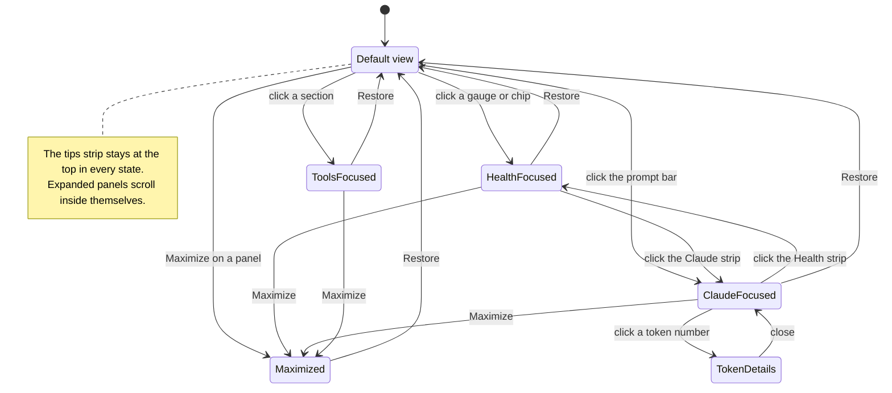
```mermaid
stateDiagram-v2
    [*] --> Lobby
    Lobby: Default view
    Lobby --> HealthFocused: click a gauge or chip
    Lobby --> ClaudeFocused: click the prompt bar
    Lobby --> ToolsFocused: click a section
    HealthFocused --> ClaudeFocused: click the Claude strip
    ClaudeFocused --> HealthFocused: click the Health strip
    HealthFocused --> Lobby: Restore
    ClaudeFocused --> Lobby: Restore
    ToolsFocused --> Lobby: Restore
    Lobby --> Maximized: Maximize on a panel
    HealthFocused --> Maximized: Maximize
    ClaudeFocused --> Maximized: Maximize
    ToolsFocused --> Maximized: Maximize
    Maximized --> Lobby: Restore
    ClaudeFocused --> TokenDetails: click a token number
    TokenDetails --> ClaudeFocused: close
    note right of Lobby
        The tips strip stays at the top in every state.
        Expanded panels scroll inside themselves.
    end note
```

### 5.3 A tool job

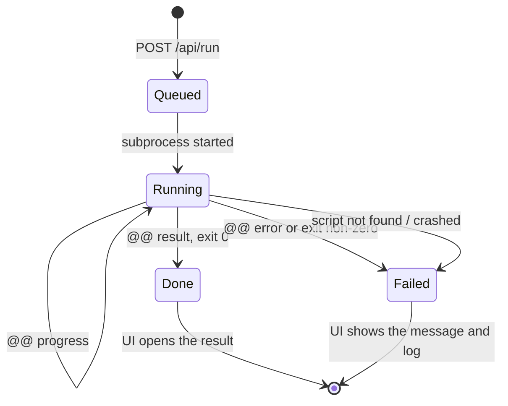
```mermaid
stateDiagram-v2
    [*] --> Queued: POST /api/run
    Queued --> Running: subprocess started
    Running --> Running: @@ progress
    Running --> Done: @@ result, exit 0
    Running --> Failed: @@ error or exit non-zero
    Running --> Failed: script not found / crashed
    Done --> [*]: UI opens the result
    Failed --> [*]: UI shows the message and log
```

### 5.4 A calendar event occurrence

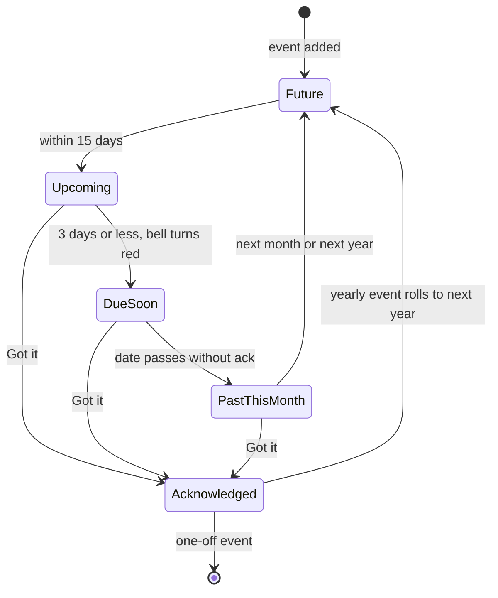
```mermaid
stateDiagram-v2
    [*] --> Future: event added
    Future --> Upcoming: within 15 days
    Upcoming --> DueSoon: 3 days or less, bell turns red
    Upcoming --> Acknowledged: Got it
    DueSoon --> Acknowledged: Got it
    DueSoon --> PastThisMonth: date passes without ack
    PastThisMonth --> Acknowledged: Got it
    Acknowledged --> Future: yearly event rolls to next year
    PastThisMonth --> Future: next month or next year
    Acknowledged --> [*]: one-off event
```

Acks are stored per occurrence (`id@year`), so next year's birthday reminds you again.

### 5.5 Stay awake (`keepawake.decide()`)

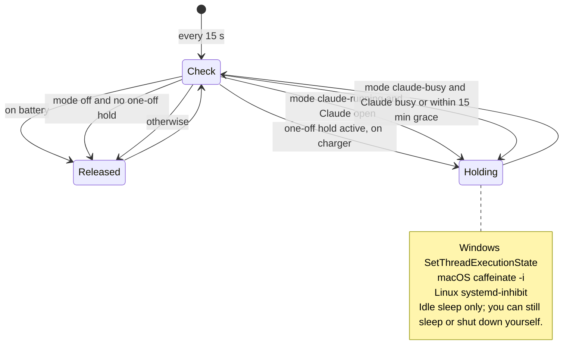
```mermaid
stateDiagram-v2
    [*] --> Check: every 15 s
    Check --> Released: on battery
    Check --> Released: mode off and no one-off hold
    Check --> Holding: one-off hold active, on charger
    Check --> Holding: mode claude-running and Claude open
    Check --> Holding: mode claude-busy and Claude busy or within 15 min grace
    Check --> Released: otherwise
    Holding --> Check
    Released --> Check
    note right of Holding
        Windows SetThreadExecutionState
        macOS caffeinate -i
        Linux systemd-inhibit
        Idle sleep only; you can still sleep or shut down yourself.
    end note
```

### 5.6 A dialog window

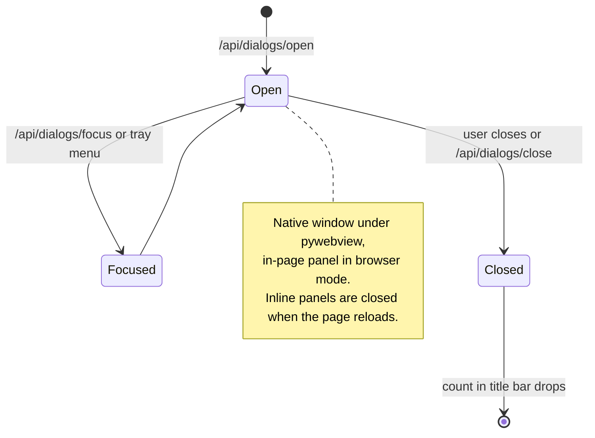
```mermaid
stateDiagram-v2
    [*] --> Open: /api/dialogs/open
    Open --> Focused: /api/dialogs/focus or tray menu
    Focused --> Open
    Open --> Closed: user closes or /api/dialogs/close
    Closed --> [*]: count in title bar drops
    note right of Open
        Native window under pywebview,
        in-page panel in browser mode.
        Inline panels are closed when the page reloads.
    end note
```

---

## 6. Sequence diagrams

### 6.1 Start-up

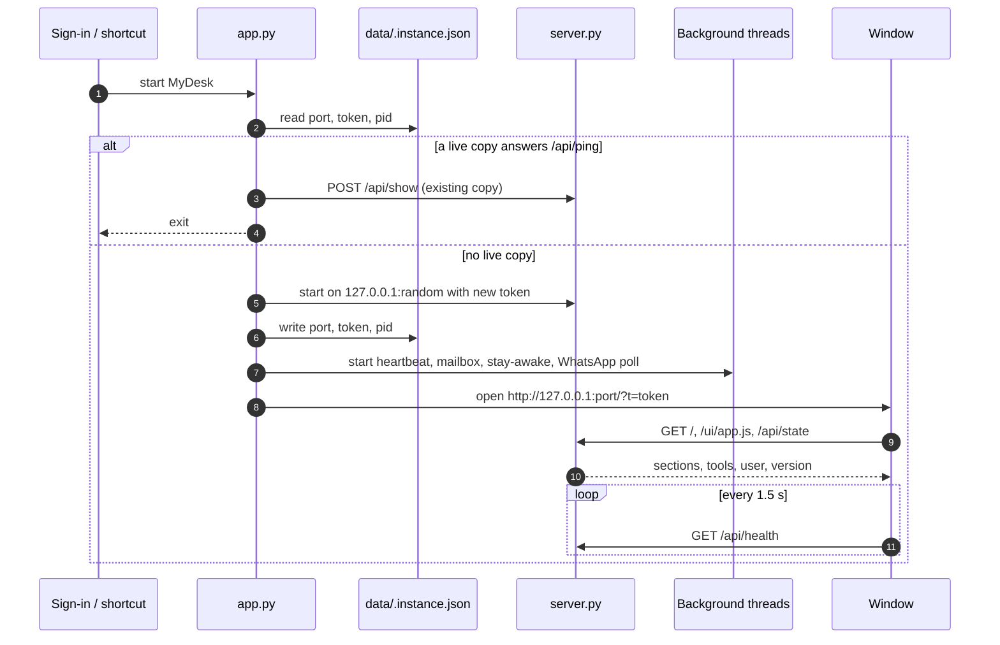
```mermaid
sequenceDiagram
    autonumber
    participant OS as Sign-in / shortcut
    participant App as app.py
    participant Inst as data/.instance.json
    participant Srv as server.py
    participant BG as Background threads
    participant Win as Window
    OS->>App: start MyDesk
    App->>Inst: read port, token, pid
    alt a live copy answers /api/ping
        App->>Srv: POST /api/show (existing copy)
        App-->>OS: exit
    else no live copy
        App->>Srv: start on 127.0.0.1:random with new token
        App->>Inst: write port, token, pid
        App->>BG: start heartbeat, mailbox, stay-awake, WhatsApp poll
        App->>Win: open http://127.0.0.1:port/?t=token
        Win->>Srv: GET /, /ui/app.js, /api/state
        Srv-->>Win: sections, tools, user, version
        loop every 1.5 s
            Win->>Srv: GET /api/health
        end
    end
```

### 6.2 Run a tool

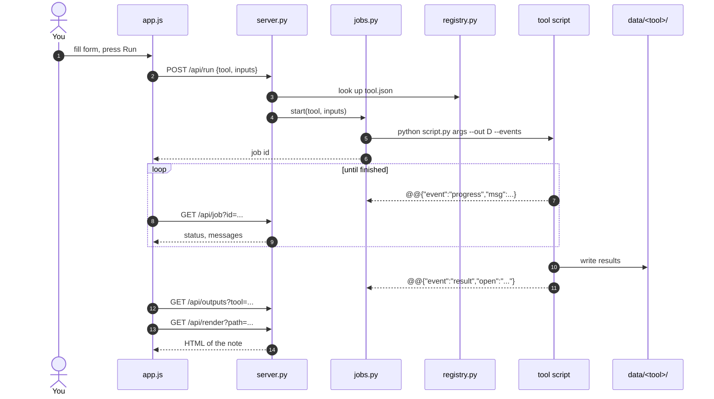
```mermaid
sequenceDiagram
    autonumber
    actor U as You
    participant UI as app.js
    participant Srv as server.py
    participant Jobs as jobs.py
    participant Reg as registry.py
    participant S as tool script
    participant D as data/<tool>/
    U->>UI: fill form, press Run
    UI->>Srv: POST /api/run {tool, inputs}
    Srv->>Reg: look up tool.json
    Srv->>Jobs: start(tool, inputs)
    Jobs->>S: python script.py args --out D --events
    Jobs-->>UI: job id
    loop until finished
        S-->>Jobs: @@{"event":"progress","msg":...}
        UI->>Srv: GET /api/job?id=...
        Srv-->>UI: status, messages
    end
    S->>D: write results
    S-->>Jobs: @@{"event":"result","open":"..."}
    UI->>Srv: GET /api/outputs?tool=...
    UI->>Srv: GET /api/render?path=...
    Srv-->>UI: HTML of the note
```

### 6.3 Clip Maker pipeline

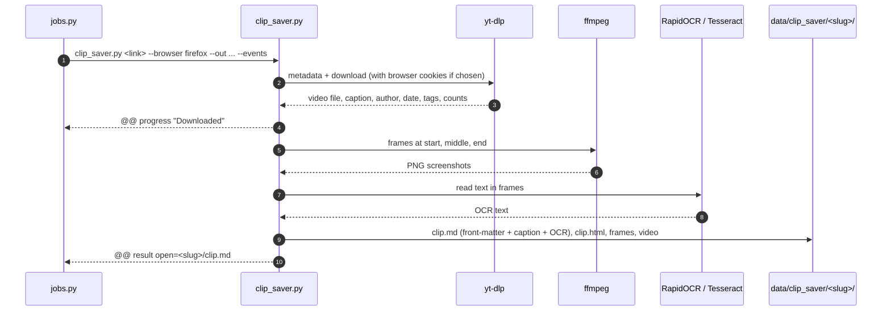
```mermaid
sequenceDiagram
    autonumber
    participant J as jobs.py
    participant C as clip_saver.py
    participant Y as yt-dlp
    participant F as ffmpeg
    participant O as RapidOCR / Tesseract
    participant D as data/clip_saver/<slug>/
    J->>C: clip_saver.py <link> --browser firefox --out ... --events
    C->>Y: metadata + download (with browser cookies if chosen)
    Y-->>C: video file, caption, author, date, tags, counts
    C-->>J: @@ progress "Downloaded"
    C->>F: frames at start, middle, end
    F-->>C: PNG screenshots
    C->>O: read text in frames
    O-->>C: OCR text
    C->>D: clip.md (front-matter + caption + OCR), clip.html, frames, video
    C-->>J: @@ result open=<slug>/clip.md
```

### 6.4 Open a MyCheats sheet

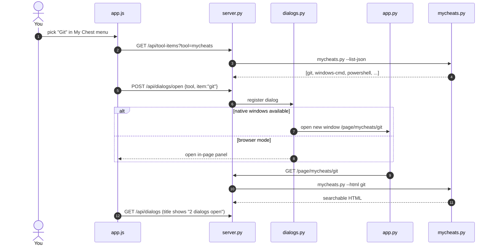
```mermaid
sequenceDiagram
    autonumber
    actor U as You
    participant UI as app.js
    participant Srv as server.py
    participant Dlg as dialogs.py
    participant App as app.py
    participant T as mycheats.py
    U->>UI: pick "Git" in My Chest menu
    UI->>Srv: GET /api/tool-items?tool=mycheats
    Srv->>T: mycheats.py --list-json
    T-->>Srv: [git, windows-cmd, powershell, ...]
    UI->>Srv: POST /api/dialogs/open {tool, item:"git"}
    Srv->>Dlg: register dialog
    alt native windows available
        Dlg->>App: open new window /page/mycheats/git
    else browser mode
        Dlg-->>UI: open in-page panel
    end
    App->>Srv: GET /page/mycheats/git
    Srv->>T: mycheats.py --html git
    T-->>Srv: searchable HTML
    UI->>Srv: GET /api/dialogs (title shows "2 dialogs open")
```

### 6.5 USB device plugged in

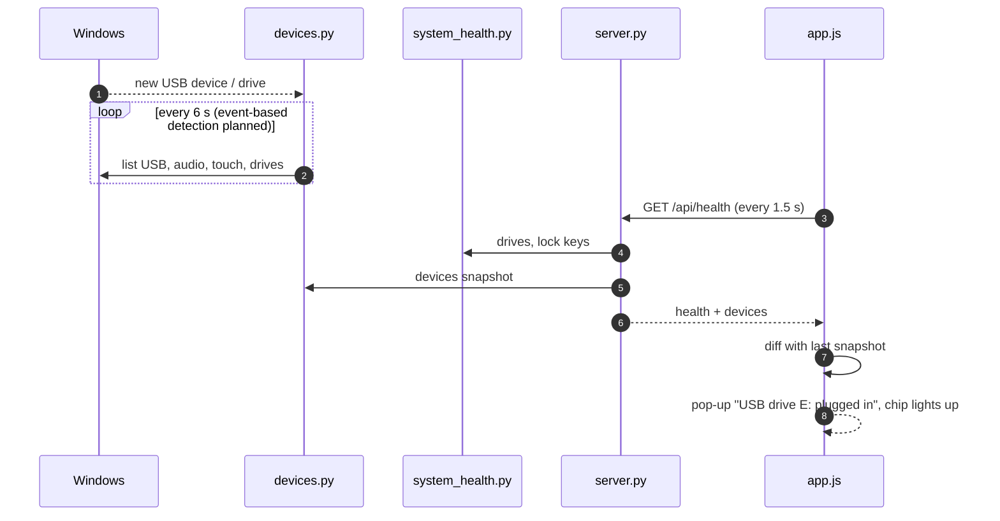
```mermaid
sequenceDiagram
    autonumber
    participant HW as Windows
    participant Dev as devices.py
    participant H as system_health.py
    participant Srv as server.py
    participant UI as app.js
    HW-->>Dev: new USB device / drive
    loop every 6 s (event-based detection planned)
        Dev->>HW: list USB, audio, touch, drives
    end
    UI->>Srv: GET /api/health (every 1.5 s)
    Srv->>H: drives, lock keys
    Srv->>Dev: devices snapshot
    Srv-->>UI: health + devices
    UI->>UI: diff with last snapshot
    UI-->>UI: pop-up "USB drive E: plugged in", chip lights up
```

### 6.6 Use MyDesk from your phone through Claude (no ports opened)

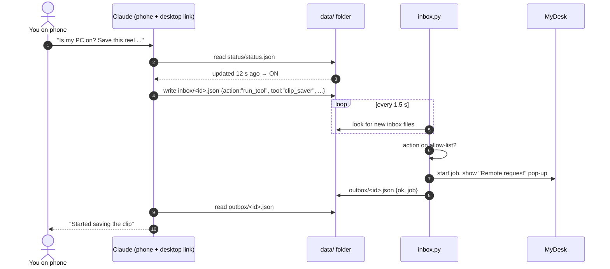
```mermaid
sequenceDiagram
    autonumber
    actor P as You on phone
    participant CA as Claude (phone + desktop link)
    participant FS as data/ folder
    participant IB as inbox.py
    participant MD as MyDesk
    P->>CA: "Is my PC on? Save this reel ..."
    CA->>FS: read status/status.json
    FS-->>CA: updated 12 s ago → ON
    CA->>FS: write inbox/<id>.json {action:"run_tool", tool:"clip_saver", ...}
    loop every 1.5 s
        IB->>FS: look for new inbox files
    end
    IB->>IB: action on allow-list?
    IB->>MD: start job, show "Remote request" pop-up
    IB->>FS: outbox/<id>.json {ok, job}
    CA->>FS: read outbox/<id>.json
    CA-->>P: "Started saving the clip"
```

Allowed actions: `ping`, `status`, `list_tools`, `run_tool`, `job`, `events`, `ack_event`, `add_event`, `notify`, `show`, `keep_awake`. Anything else is refused.

### 6.7 WhatsApp command through the relay

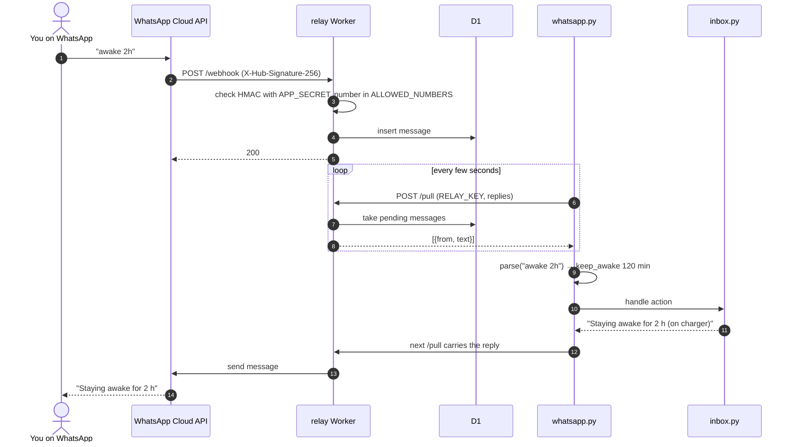
```mermaid
sequenceDiagram
    autonumber
    actor P as You on WhatsApp
    participant M as WhatsApp Cloud API
    participant W as relay Worker
    participant DB as D1
    participant WA as whatsapp.py
    participant IB as inbox.py
    P->>M: "awake 2h"
    M->>W: POST /webhook (X-Hub-Signature-256)
    W->>W: check HMAC with APP_SECRET, number in ALLOWED_NUMBERS
    W->>DB: insert message
    W-->>M: 200
    loop every few seconds
        WA->>W: POST /pull (RELAY_KEY, replies)
        W->>DB: take pending messages
        W-->>WA: [{from, text}]
    end
    WA->>WA: parse("awake 2h") → keep_awake 120 min
    WA->>IB: handle action
    IB-->>WA: "Staying awake for 2 h (on charger)"
    WA->>W: next /pull carries the reply
    W->>M: send message
    M-->>P: "Staying awake for 2 h"
```

Commands: `status`, `awake 2h` / `awake 90m`, `awake until <program>`, `sleep ok`, `clip <link>`, `events`, `ports`, `say <text>`, `show`, `help`.

### 6.8 "Is my computer on?"

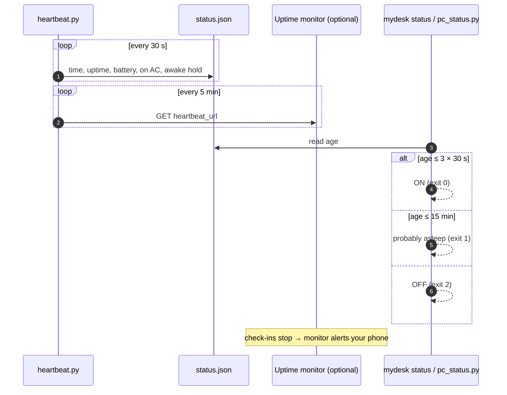
```mermaid
sequenceDiagram
    autonumber
    participant HB as heartbeat.py
    participant FS as status.json
    participant Mon as Uptime monitor (optional)
    participant Q as mydesk status / pc_status.py
    loop every 30 s
        HB->>FS: time, uptime, battery, on AC, awake hold
    end
    loop every 5 min
        HB->>Mon: GET heartbeat_url
    end
    Q->>FS: read age
    alt age ≤ 3 × 30 s
        Q-->>Q: ON (exit 0)
    else age ≤ 15 min
        Q-->>Q: probably asleep (exit 1)
    else
        Q-->>Q: OFF (exit 2)
    end
    Note over Mon: check-ins stop → monitor alerts your phone
```

### 6.9 Upgrade (planned for step 7; `mydesk backup` exists today)

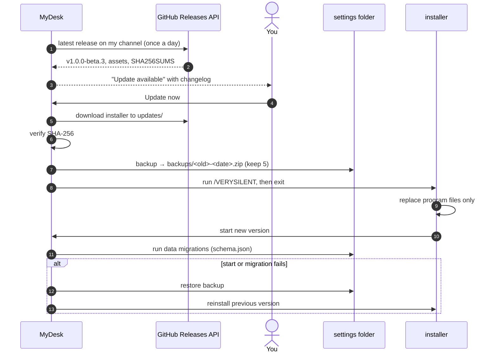
```mermaid
sequenceDiagram
    autonumber
    participant MD as MyDesk
    participant GH as GitHub Releases API
    actor U as You
    participant FS as settings folder
    participant Setup as installer
    MD->>GH: latest release on my channel (once a day)
    GH-->>MD: v1.0.0-beta.3, assets, SHA256SUMS
    MD-->>U: "Update available" with changelog
    U->>MD: Update now
    MD->>GH: download installer to updates/
    MD->>MD: verify SHA-256
    MD->>FS: backup → backups/<old>-<date>.zip (keep 5)
    MD->>Setup: run /VERYSILENT, then exit
    Setup->>Setup: replace program files only
    Setup->>MD: start new version
    MD->>FS: run data migrations (schema.json)
    alt start or migration fails
        MD->>FS: restore backup
        MD->>Setup: reinstall previous version
    end
```

### 6.10 Release build

```mermaid
sequenceDiagram
    autonumber
    actor Dev as Maintainer
    participant Git as GitHub repo
    participant CI as ci.yml
    participant R as release.yml
    participant Rel as GitHub Release
    Dev->>Git: git push (any branch)
    Git->>CI: compile, tool.json check, unit tests on Windows, macOS, Linux
    Dev->>Git: git tag v1.0.0-beta.3 && git push --tags
    Git->>R: tag v*
    par build
        R->>R: wheel + sdist (ubuntu)
        R->>R: PyInstaller + Inno Setup (windows)
        R->>R: PyInstaller .app (macos)
        R->>R: PyInstaller tar.gz (ubuntu)
    end
    R->>R: SHA256SUMS.txt
    R->>Rel: create release (pre-release when tag has -beta), upload assets
```

---

## 7. Security model

| Concern | How MyDesk handles it |
| --- | --- |
| Other programs or sites calling the local server | Binds to `127.0.0.1` only; every request needs the per-launch token (header `X-MyDesk-Token` or `?t=`); a new token each start |
| Remote control | No inbound ports. Phone access is a file mailbox (via the Claude desktop app) or outbound polling of your own relay |
| What a remote request can do | Fixed allow-list of actions; tools only, never shell commands; every remote action pops up on screen |
| WhatsApp spoofing | Relay checks Meta's `X-Hub-Signature-256` HMAC and `ALLOWED_NUMBERS`; MyDesk authenticates to `/pull` with `RELAY_KEY` |
| Secrets | API keys from environment variables or `config.json`, both outside git; cookies read from your browser at run time, never stored |
| Personal data | `config.json`, `data/`, `backups/` are git-ignored and outside the program folder for installed copies |
| Updates | Planned: SHA-256 checked against `SHA256SUMS.txt`, never silent, backup first |

---

## 8. Design decisions

| Decision | Why | Trade-off |
| --- | --- | --- |
| Python stdlib HTTP server + web UI | No framework to install; UI is plain HTML/CSS/JS with no build step | Hand-written routing |
| pywebview with a browser fallback | Native window on all three systems; still works if WebView2/Qt is missing | Browser mode can't do native dialog windows |
| Every tool is a script + `tool.json` | Tools run alone from a terminal, can't freeze the window, and others can add tools without touching core | One process per run |
| `@@{json}` lines for progress | Works with any language; plain output still readable | Scripts must flush output |
| JSON/Markdown files, no database | Zero setup, easy backup, readable | Move to SQLite for token history and search |
| File mailbox for phone use | No exposed API; works through the Claude desktop app's folder link | A few seconds of latency |
| Relay polled outbound | No port forwarding or tunnel on the PC | Needs a free Cloudflare account |
| Per-user data folder when installed | Updates and uninstalls never touch your data | Source checkouts use the repo folder, so two places to know about |
| Twin executables (`MyDesk`, `MyDesk-tool`) | Frozen builds still run tool scripts and a console CLI | Slightly larger bundle |
